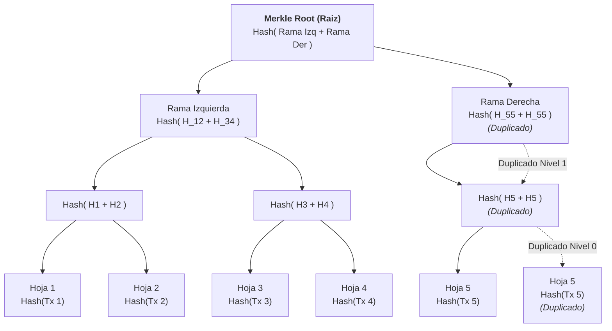
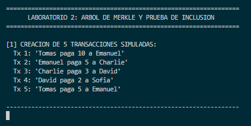
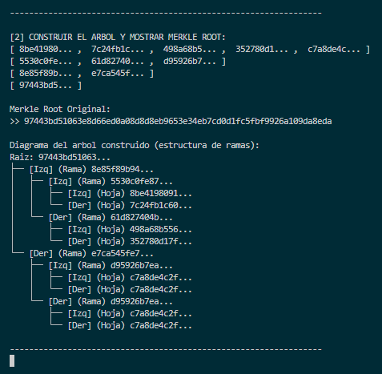
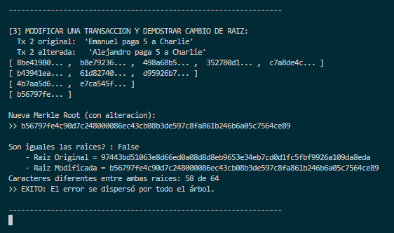
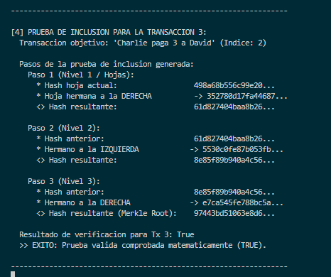
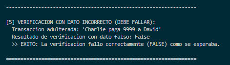
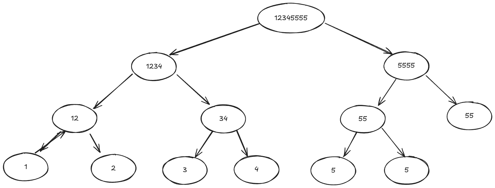

# Laboratorio 2: Arbol de Merkle y Pruebas de Inclusión


-orange?style=flat)


 
**Materia**: Estructura de Datos y Laboratorio  
Implementación de un **Arbol de Merkle** criptográfico en Python utilizando el algoritmo **SHA-256**, diseñado para verificar la integridad de bloques de datos y generar pruebas de inclusión (*Merkle Proofs*).


## Representación del Arbol

A diferencia de implementaciones basadas únicamente en arreglos planos, este proyecto modela una **estructura de datos en arbol binario real en memoria**:

- **Clase `Nodo`:** Cada nodo almacena su sha256 (`valor`), referencias directas a sus hijos (`izquierda`, `derecha`) y una referencia a su nodo ascendente (`padre`). Esta relación bidireccional facilita subir por el arbol de manera inmediata al generar pruebas de inclusión.
- **Clase `MerkleTree`:** Administra la construcción jerárquica nivel por nivel (`self.niveles`).
- **Regla del nodo impar:** Si en algún nivel hay una cantidad impar de nodos, el último elemento se duplica a sí mismo para completar la pareja (`Nodo(nodos[i], nodos[i])`).

> [!Note]
> Realmente una solucion mas optima es la que usa arreglos de tamaño fijo por ejemplo con numpy o en un lenguaje de bajo nivel y realizar el acceso a padre o hijo mediante calculos de indices, pero optamos para la solucion de este laboratorio por representar el arbol mediante una estructura de datos dinamica para recordar los conceptos de Logica y Representacion II (Listas Doblemente Ligadas y Arboles Binarios).
---

## Diagrama del Arbol (5 Transacciones)



---

## Requisitos e Instalación

No se requieren librerías externas. El proyecto funciona con la biblioteca estándar de Python:

- **Python 3.8+**
- Módulos estándar: `hashlib`, `sys`

Clonar el repositorio y verificar la instalación de Python:

```bash
# Clonar el repositorio
git clone https://github.com/ema28pro/merkle-tree-python.git

# Verificar versión de Python
python --version
```

---

## Ejecución y Pruebas

> [!NOTE]
> Para el desarrollo de la cuadrícula, centrado matemático y renderizado de ramas en consola del módulo de visualización ([visualizador.py](visualizador.py)), nos apoyamos en herramientas de Inteligencia Artificial.
> 
> * Para profundizar en los conceptos teóricos y especificaciones criptográficas, consulta [doc.md](doc.md).
> * Para ver el desglose técnico detallado de cada clase y método de [main.py](main.py), consulta [main.md](main.md).

El proyecto cuenta con las siguientes variantes y puntos de entrada:

### 1. Experimentos guiados del laboratorio (`test.py`)
Ejecuta el conjunto de 5 pasos del experimento (creación, cálculo de raíz, prueba del efecto avalancha por alteración, generación/verificación de prueba de inclusión y detección de transacciones falsas):

```bash
python test.py
```

### 2. Entorno interactivo y visualizador (`main.py`)
Muestra la construcción del arbol con nodos dinámicos enlazados, el visualizador vertical en consola y la prueba interactiva definida en la función `app()`:

```bash
python main.py
```

### 3. Versión simplificada con listas (`merkle_lists.py`)
Una implementación ultra compacta (~30 líneas) sin dependencias externas que prescinde de la clase `Nodo` y punteros, resolviendo la jerarquía y la prueba de inclusión únicamente con listas nativas de Python y cálculo de índices (`idx // 2` y hermano por paridad):

```bash
python merkle_lists.py
```


## Resultados y Evidencias de los Experimentos

A continuación se presentan las capturas correspondientes a la ejecución paso a paso de los 5 experimentos guiados en [test.py](test.py):

### Paso 1: Creación de 5 transacciones simuladas
Muestra la definición e inicialización de las 5 transacciones de datos base:


### Paso 2: Construcción del arbol y cálculo de la raíz (Merkle Root)
Construcción ascendente (*bottom-up*), cálculo de la Merkle Root y diagrama de ramas:


### Paso 3: Modificación de una transacción y demostración del efecto avalancha
Alteración de un solo valor en la transacción 2 y comparación carácter a carácter de las raíces resultantes:


### Paso 4: Generación y verificación de prueba de inclusión (Transacción 3)
Cálculo de la ruta de hashes hermanos (Merkle Proof) y verificación matemática paso a paso:


### Paso 5: Verificación con dato incorrecto (Detección de fraude)
Comprobación de que una transacción con datos adulterados no coincide con la raíz del arbol y es rechazada (`False`):


---


